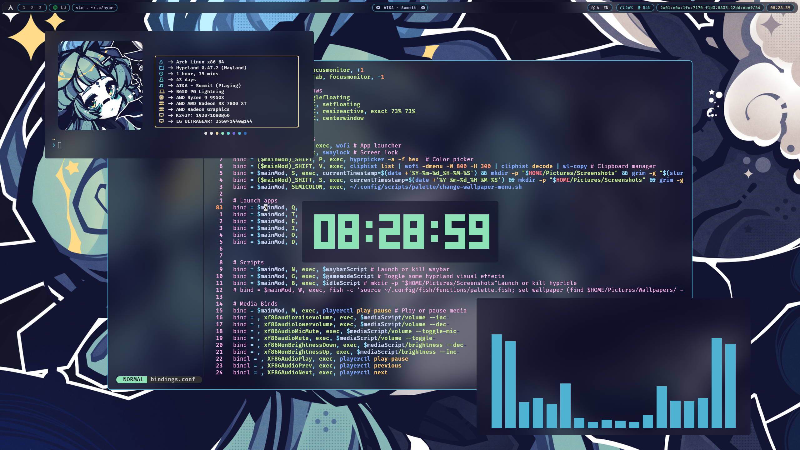
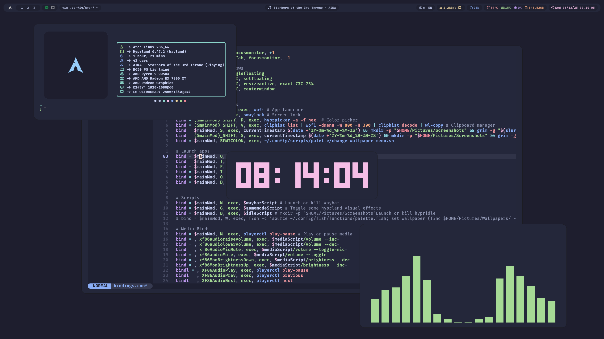
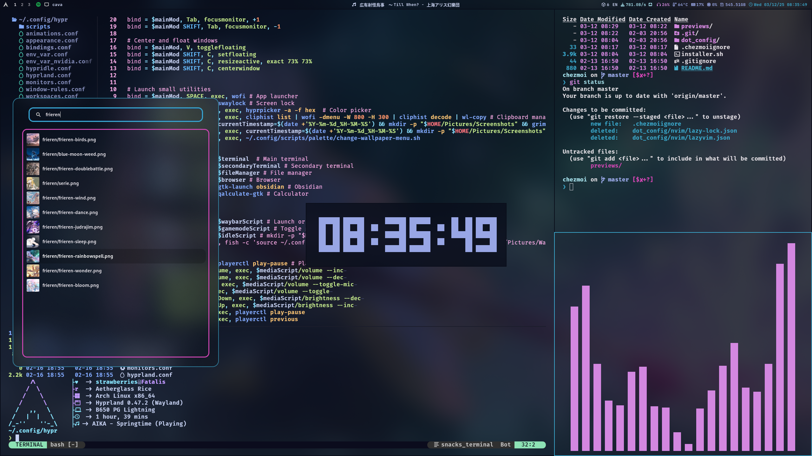

# My [Arch Linux](https://archlinux.org) & [Hyprland](https://hyprland.org) dotfiles

🌸 <strong>Pretty Desktop</strong> (wal colors)

    

🌑 <strong>Matte Desktop</strong>

    

🎨 <strong>Focus Desktop</strong> (wal colors)

    

Uses [chezmoi](https://chezmoi.io) to quickly install and maintain.

## Utilities

Some projects of mine are embeded in this config.

### Themes

I am using my [theme switcher](https://github.com/eiiko6/linux-theme-switcher) script that creates symlinks in **.config**. Thus some appearance configuration files located in **.config** are irrelevant or missing and are actually located in **.config/theme-switcher/themes/**.

### Wallpapers

Wallpapers and wal color schemes are managed by [palette](https://github.com/eiiko6/palette).

## Installation

**installer.sh** should install the dependencies and apply the configs on any base Arch installation.
